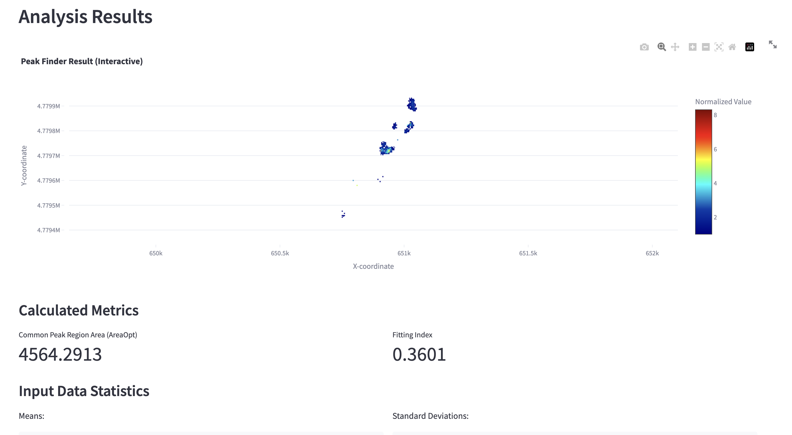

# PeakLocator Application

This is a web application built with Python and Streamlit to analyze and compare spatial grid files (e.g., Surfer `.grd` format). The application allows users to upload multiple grid files, define parameters, and compute a resulting grid that identifies common peak or trough regions across the datasets.

This project is a modern migration of an original Flask-based application, now featuring an interactive, user-friendly interface powered by Plotly and Streamlit.



## Features

-   **Dynamic File Inputs**: Start with two input slots and add up to 10 dynamically.
-   **Interactive Plots**: All data visualizations are rendered with Plotly, allowing for zoom, pan, and hover-to-inspect data points.
-   **Live Input Preview**: A dedicated "Input Data Viewer" tab lets you inspect uploaded files before running the full computation.
-   **Configurable Parameters**: Set Min/Max and a numeric Sigma value for each input file.
-   **Advanced Options**: Fine-tune the analysis with options for interpolation method (`nearest`, `linear`, `cubic`) and result map colorscale.
-   **Result Caching**: The `st.cache_data` feature ensures that computations are not re-run unnecessarily, providing instant results for repeated analyses.
-   **Download Results**: Download the final computed grid as a standard Surfer `.grd` file.
-   **Reproducible Environment**: Uses a Conda `environment.yml` file for easy and reliable setup.

## Prerequisites

Before you begin, ensure you have **Anaconda** or **Miniconda** installed on your system. This will be used to manage the project environment and its dependencies.

-   [Download Anaconda Distribution](https://www.anaconda.com/products/distribution)

## Installation and Setup

Follow these steps to set up the project environment and get the application running.

**1. Clone the Repository**

First, clone this repository to your local machine or download the source files.

```bash
git clone https://github.com/demichie/peakLocator_1.0
cd peakLocator_1.0
```

**2. Create the Conda Environment**

Use the provided `environment.yml` file to create a new Conda environment with all the necessary dependencies. This command will create an environment named `peakLocator-env`.

```bash
conda env create -f environment.yml
```

This process may take a few minutes as Conda resolves and installs all the packages.

**3. Activate the Conda Environment**

Once the environment is created, you must activate it. All subsequent commands should be run inside this environment.

```bash
conda activate peakLocator-env
```

Your terminal prompt should now be prefixed with `(peakLocator-env)`.

## Running the Application

With the Conda environment activated, you can launch the Streamlit application with a single command:

```bash
streamlit run app_streamlit.py
```

Streamlit will start a local web server, and the application should automatically open in your default web browser. If it doesn't, the terminal will provide a local URL (usually `http://localhost:8501`) that you can navigate to.

## How to Use

1.  **Input Configuration Tab**:
    -   Upload at least two `.grd` files using the file uploaders.
    -   Adjust the "Min/Max" and "Sigma" parameters for each file.
    -   Use the "Add/Remove Slot" buttons to manage the number of inputs.
    -   Optionally, expand "Advanced Options" to change the interpolation method or result colorscale.
    -   Click the **"Run Computation"** button to start the analysis.

2.  **Input Data Viewer Tab**:
    -   After uploading files on the first tab, you can come here to preview them.
    -   Use the dropdown menu to select which uploaded file you want to inspect.

3.  **Results Tab**:
    -   After a successful computation, this tab will display the interactive result map.
    -   Calculated metrics like "Fitting Index" and "Area" are shown below the map.
    -   Use the **"Download Result"** button to save the output grid to your computer.

## Project Structure

```
.
├── app_streamlit_final.py   # The main Streamlit application file.
├── compute.py               # Core computation and plotting logic.
├── environment.yml          # Conda environment definition.
└── README.md                # This file.
```

## License

This project is licensed under the MIT License. See the `LICENSE` file for details.

## Authors

This tool has been developed by M. de' Michieli Vitturi and D. Granieri


